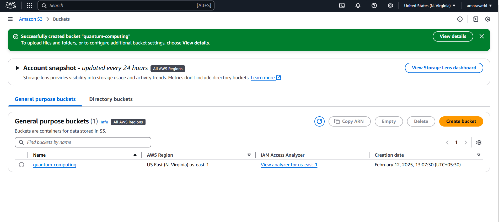
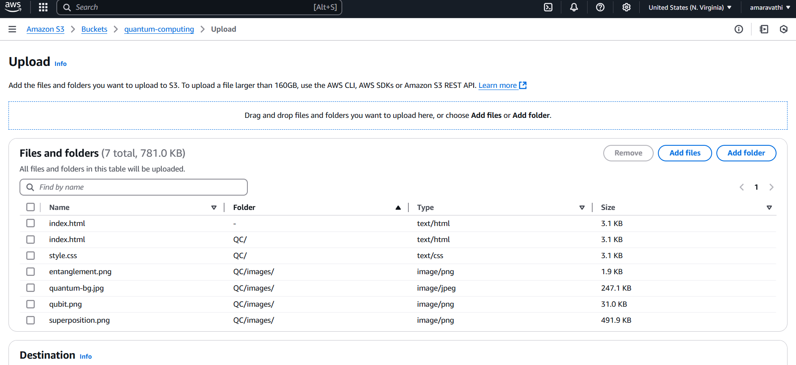
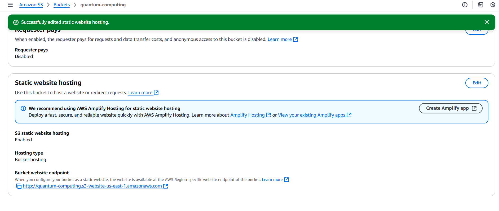
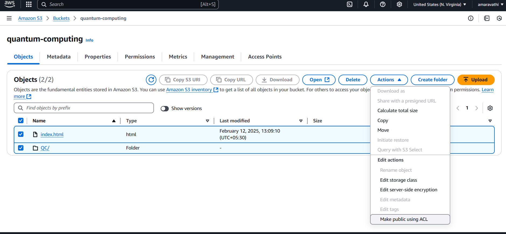
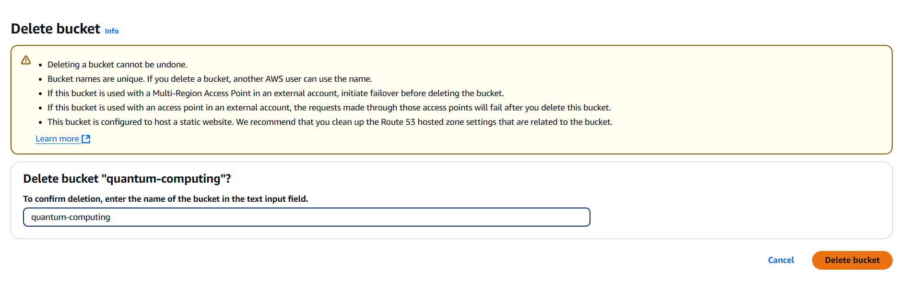

# Host a Website on Amazon S3

## Introduction
This project demonstrates how to host a static website using **Amazon S3**.
Amazon S3 (Simple Storage Service) allows users to store and retrieve data, including website files, in highly scalable storage buckets.

## Project Details
- **Author:** P. Amaravathi
- **Platform:** [NextWork.org](https://community.nextwork.org/c/i-have-a-question?automatic_login=true)
- **Estimated Completion Time:** 15 minutes

## What is Amazon S3?
Amazon S3 (Simple Storage Service) is a cloud storage service by AWS that lets you store and retrieve any amount of data from anywhere on the web. Here's what you need to know:

Key Points:
- It stores data in "buckets" (like folders)
- Offers unlimited storage capacity
- Highly reliable (99.999999999% durability)
- Pay only for what you use
- Common uses: website hosting, app data storage, backups, media storage
- Different storage classes available for different needs (from frequently accessed to archive)
- Built-in security features like encryption and access controls

Think of it like a super-reliable, infinitely large hard drive in the cloud that you can access from anywhere.

## Steps to Host a Website on S3

### 1. Create an S3 Bucket
- Creating a bucket takes less than **2 minutes**.
- **Selected Region:** `US East (N. Virginia) us-east-1`.
- Ensure that the **bucket name is globally unique**.
  

### 2. Upload Website Files
- Upload `index.html` and necessary image assets.
- These files are essential for setting up the website.
- I have already uploaded the files I used in this particularrepository.

  

### 3. Enable Static Website Hosting
To enable public access to the website:
- Go to the **S3 bucket settings** and choose `Enable` for **Static Website Hosting**.
- Select `Host a static website` as the hosting type.
- Set `index.html` as the **Index Document**.
- Modify the **ACL (Access Control List)** to allow public access.
- 

### 4. Bucket Endpoint & Public Access
- Once static website hosting is enabled, AWS provides a **Bucket Endpoint URL**.
- Initially, visiting the URL may result in a **403 Forbidden Error** due to private object permissions.
- To fix this:
  - Select `index.html` and the asset files.
  - Click **Actions** → `Make public using ACL`.
  - 

### 5. Success!
- After adjusting the permissions, the static website will be publicly accessible.
- The project successfully demonstrates hosting a website on Amazon S3.
- 

### 📣NOTE:
Delete all your resources by the end of the day, even if you don't finish the entire project.
If you don't delete an Amazon S3 bucket, it will remain and you'll be charged for storage. You can empty the bucket and block requests to it!

## Additional Resources
For more projects and community discussions, visit:
[NextWork.org](https://community.nextwork.org/c/i-have-a-question?automatic_login=true)
